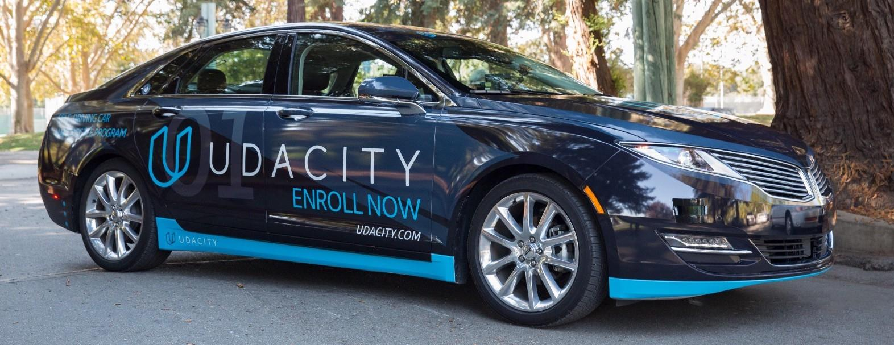
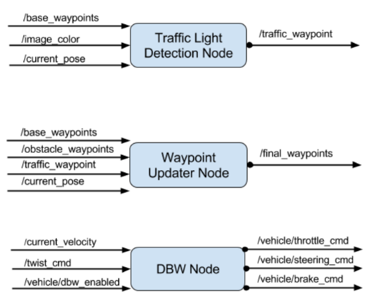
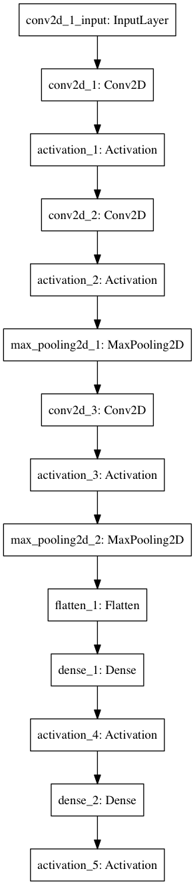

# An Autonomous Vehicle System For Udacity's Carla

* * *



In this project, we built ROS nodes to implement the core functionality of the autonomous vehicle system, including traffic light detection and classification, vehicle control control, and waypoint following. This software system will be deployed on Carla (Udacity’s Self Driving Lincoln MKZ) to autonomously drive it around a test track.

## The Team

* Maciej Dziubinski (ponadto@gmail.com)
* Ankit Shrivastava (shrivastavaanki700@gmail.com)
* Mohamed Ameen (mohamed.a.ameen93@gmail.com)

## Software Architecture

The following graph presents the ROS nodes and ROS topics comprising the system:


We were responsible for three nodes in particular:

* the `'tl_detector'` node (implemented in the `tl_detector` package) that publishes
  to the `/traffic_waypoint` topic the location to stop before a red light.
* the `'waypoint_updater'` node (implement in the `waypoint_updater` package)
  that publishes a list of waypoints (which determine the velocity) ahead of the
  car to the `/final_waypoints` topic.
* the `'dbw_node'` (in the `twist_controller` package) that publishes to three
  topics: `vehicle/throttle_cmd`, `/vehicle/brake_cmd`, and `/vehicle/steering_cmd`
  which control the car.

A good summary of those three nodes is presented below:



*Note: For this project, the obstacle detection node is not implemented*

## Code structure

The following excerpt from the `tree` command summarizes the structure of the
`ros/src` directory (actually, the nodes that were presented in the
**Project structure** section above):

```
./ros/src
...
│
├── tl_detector
│   ├── light_classification
│   │   └── tl_classifier.py
│   ├── light_publisher.py
│   └── tl_detector.py
│
├── twist_controller
│   ├── dbw_node.py
│   ├── dbw_test.py
│   ├── lowpass.py
│   ├── pid.py
│   ├── twist_controller.py
│   └── yaw_controller.py
│
└── waypoint_updater
    └── waypoint_updater.py
```

## Perception Subsystem

This subsystem is responsible for detecting and inferring the environment surrounding the vehicle, and publishing relevant information to other subsystems. Specifically, this subsystem determines the state of the upcoming traffic lights and publishes this status to other subsystems.

### Traffic Light Detection Node

This node processes images provided by the vehicle’s onboard camera and publishes upcoming traffic light information to the `/traffic_waypoint` topic. The Waypoint Updater node uses this information to determine if/when the car should slow down to safely stop at upcoming red lights.

#### Traffic Light Classification using Deep Neural Networks
We initially trained a basic neural network to do the classification task. The network architecture is shown below:



For training images, a combination of web scraping, simulator image capturing, and ROSbag image capturing was used. We used Keras (with Tensorflow as backend) for training with a total of 2,000 images (10% of which as validation/test samples).

*Note: This model, and the included data, is based on [this](https://github.com/kcg2015/traffic_light_detection_classification) project on GitHub.

Although the model's results were acceptable, we decided to use an SSD model to simultaneousely detect and classifiy the traffic lights, instead for building twi separate models, one for detection, and another one for classification.

#### Single Shot Detection (SSD) Model

This approach means basically using a pre-trained model to detect and classify the traffic lights.
After experimenting with different models, including SSD, FRCNN, and RFCN, we found out that an FRCNN model pre-trained on [COCO dataset](http://cocodataset.org/) would perform very well, but the problem is it was very slow, we needed something really fast!
SSD model was extremely faster that FRCNN, but its performance was poor. So finally, we decided to use an SSD model pre-trained on [COCO dataset](http://cocodataset.org/), and then retrained on [Apollo Traffic Lights Detection Dataset](http://data.apollo.auto/help?name=data_intro_2d&data_key=traffic_light_label&data_type=0&locale=en-us&lang=en).
We extraxted the site data from the `rosbag` provided by Udacity and applied the model, and it was very accurate on detecting and classifying the traffic lights.


**[Youtube Link](https://youtu.be/KHAbB0MJ4js)**


## Planning Subsystem

The planning subsystem determines the vehicle’s path based on the current position and velocity along with the state of the traffic lights. A list of waypoints to follow is passed on to the control subsystem.

### Waypoint Updater Node

The eventual purpose of this node is to publish a fixed number of waypoints ahead of the vehicle with the correct target velocities, depending on traffic lights and obstacles. This node subscribes to three topics to get the entire list of waypoints, the vehicle’s current position, and the state of the traffic lights. Then the node publishes a list of waypoints to follow, each waypoint contains a position on the map and a target velocity.


## Control Subsystem

This subsystem publishes control commands for the vehicle’s steering, throttle, and brakes based on a list of waypoints to follow. 

### Waypoint Follower Node

This node is implemented by Udacity. It parses the list of waypoints to follow and publishes proposed linear and angular velocities to the `/twist_cmd` topic.

### Drive By Wire (DBW) Node

The goal for this part of the project is to implement the drive-by-wire node which will subscribe to `/twist_cmd` and use various controllers to provide appropriate throttle, brake, and steering commands. These commands can then be published to the following topics:
1. `/vehicle/throttle_cmd`
2. `/vehicle/brake_cmd`
3. `/vehicle/steering_cmd`

---

### Usage

1. Clone the project repository.
```bash
git clone https://github.com/MTDzi/CarND-Capstone
```

2. Install python dependencies.

3. Make and run styx.
```bash
cd ros
catkin_make
source devel/setup.sh
roslaunch launch/styx.launch
```
4. Run the [simulator](https://github.com/udacity/CarND-Capstone/releases).

### Real world testing
1. Download [training bag](https://s3-us-west-1.amazonaws.com/udacity-selfdrivingcar/traffic_light_bag_file.zip) that was recorded on the Udacity self-driving car.
2. Unzip the file.
```bash
unzip traffic_light_bag_file.zip
```
3. Play the bag file.
```bash
rosbag play -l traffic_light_bag_file/traffic_light_training.bag
```
4. Launch your project in site mode.
```bash
cd CarND-Capstone/ros
roslaunch launch/site.launch
```
5. Confirm that traffic light detection works on real life images.
